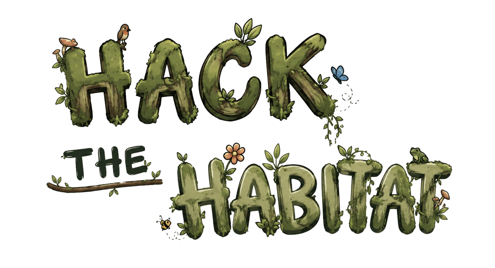
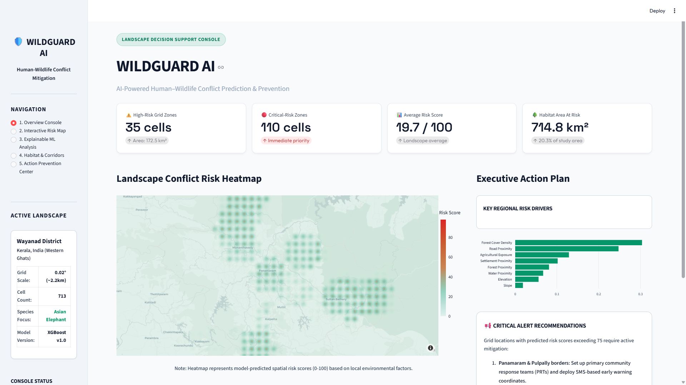

# 🛡️ WildGuard AI
### AI-Powered Human–Wildlife Conflict Prediction & Prevention

<div align="left">
    
    
    
    
    
    
    
    
    
    
</div>

<br>

WildGuard AI is a complete, hackathon-ready geospatial decision-support system designed to predict human-elephant conflict (HEC) hotspots, map ecological suitability, and recommend targeted conservation actions.



This project was built for the **"Hack the Habitat"** hackathon (Theme: *"Build tech that protects the planet"*), focusing on the **Wayanad District in Kerala, India**—a global HEC hotspot in the Western Ghats mountain range.

---

## 🚀 Quickstart Guide

Ensure you have Python 3.10+ installed. Follow these steps to set up the environment, run the ML pipeline, and launch the interactive conservation console:

### 1. Install Dependencies
```bash
pip install -r requirements.txt
```

### 2. Run the Data & Training Pipeline
Execute the scripts in order to download GIS features, build spatial grids, generate topographical features, and train the predictive models:
```bash
# Fetch settlements, forests, roads, and water bodies from OSM (with offline fallbacks)
python scripts/download_data.py

# Process raw features, generate grid cells (0.02° resolution), and calculate distance metrics
python scripts/preprocess.py

# Add simulated SRTM-derived elevation and slope, and map literature conflict hotspots
python scripts/build_features.py

# Run K-Means Spatial Cross-Validation, train final XGBoost model, and export metrics/explainer
python scripts/train.py
```

### 3. Launch the Conservation Console
```bash
streamlit run app/main.py
```

---

## 📊 Modeling & Performance

To prevent **spatial leakage** caused by spatial autocorrelation (grid cells near each other sharing identical environmental contexts), WildGuard AI uses a **Geographically Aware Spatial Cross-Validation** strategy. Grid cells are clustered into 5 distinct geographic zones using K-Means, and model validation is performed by holding out entire spatial clusters.

### Spatial K-Fold Validation Results:

| Model | Spatial ROC-AUC | PR-AUC (Avg Precision) | F1-Score | Precision | Recall |
| :--- | :--- | :--- | :--- | :--- | :--- |
| **XGBoost Classifier (Selected)** | **0.8911** | **0.6483** | **0.5978** | **0.6328** | **0.5664** |
| **Logistic Regression Baseline** | 0.8931 | 0.6912 | 0.6190 | 0.7156 | 0.5455 |
| **Random Forest Baseline** | 0.9014 | 0.6346 | 0.5938 | 0.6726 | 0.5315 |

The trained model and its SHAP TreeExplainer are saved as serialized artifacts under `models/` for real-time inference and local explainability in the dashboard.

---

## 💡 System Features

* **Overview Console**: Executive summary of conflict risk, metrics (total at-risk habitat in $km^2$), and high-risk alerts.
* **Interactive Risk Map**: 713-cell Folium grid map overlay of Wayanad. Click any cell to retrieve localized environmental attributes and run on-the-fly local **SHAP log-odds explanations** of the risk drivers.
* **Explainable ML Analysis**: Spatial cross-validation ROC/PR metrics curves and a global SHAP feature importance summary.
* **Habitat & Corridors**: Calculates a transparent connectivity suitability score (0-100) based on vegetation, water proximity, road barriers, and human pressure.
* **Action Prevention Center**: Generates prioritized, rule-based recommendation cards (electric fences, alternate crop buffer zones, alarms) based on local cell vulnerability metrics.

---

## 🛠️ Directory Structure

```
wildguard-ai/
│
├── app/
│   ├── main.py                # Main launcher console
│   ├── config.py              # Custom theme CSS & asset paths
│   └── pages/
│       ├── __init__.py
│       ├── overview.py        # Executive summaries & KPI cards
│       ├── risk_map.py        # Folium interactive grid & local SHAP
│       ├── risk_analysis.py   # Spatial validation metrics & global SHAP bar chart
│       ├── corridors.py       # Habitat connectivity zones
│       └── prevention.py      # Action recommendation engine card system
│
├── data/
│   ├── raw/                   # Downloaded GeoJSON layers
│   ├── processed/             # Grid features CSV files
│   └── SOURCES.md             # Dataset licenses and metadata
│
├── models/
│   ├── xgb_model.json         # Serialized XGBoost booster
│   ├── shap_explainer.pkl     # Serialized SHAP explainer
│   └── metrics.json           # Model validation outputs
│
├── scripts/
│   ├── download_data.py       # Queries Overpass API
│   ├── preprocess.py          # Spatial grid and distance calculator
│   ├── build_features.py      # Elevation/slope + target creation
│   └── train.py               # Spatial CV & model training
│
├── requirements.txt           # Python dependencies
├── .gitignore
├── LICENSE                    # MIT License
└── README.md                  # System overview and quickstart
```

---

### Overview



## 🛡️ Scientific Wording Disclaimer
> **"WildGuard AI estimates spatial human–elephant conflict risk using historical conflict patterns and environmental/geospatial factors. It does not track animals or predict exact movement paths in real-time."**

Recommendations are intended as **decision-support guidelines** for forest rangers, local panchayats, and NGOs to optimize resources (fencing, patrol routes, community alarms) and are not guaranteed conflict-prevention solutions.
